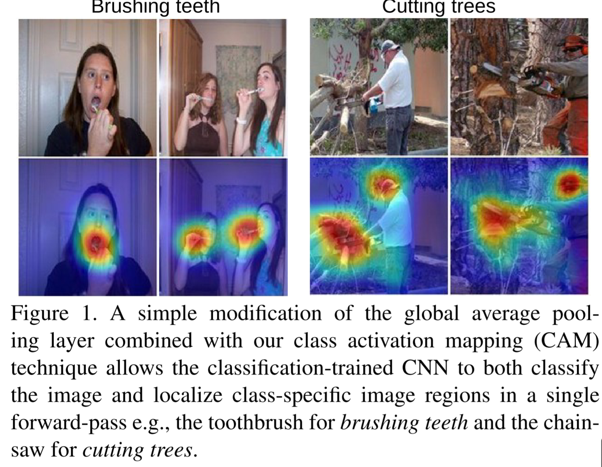
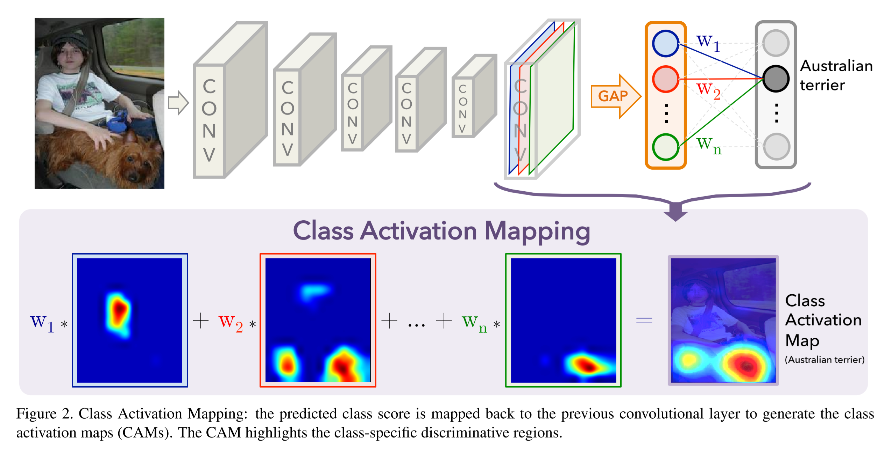
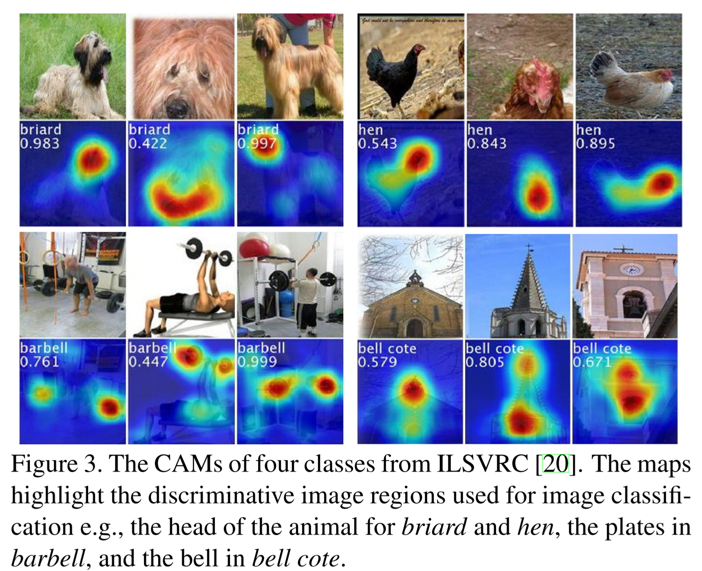
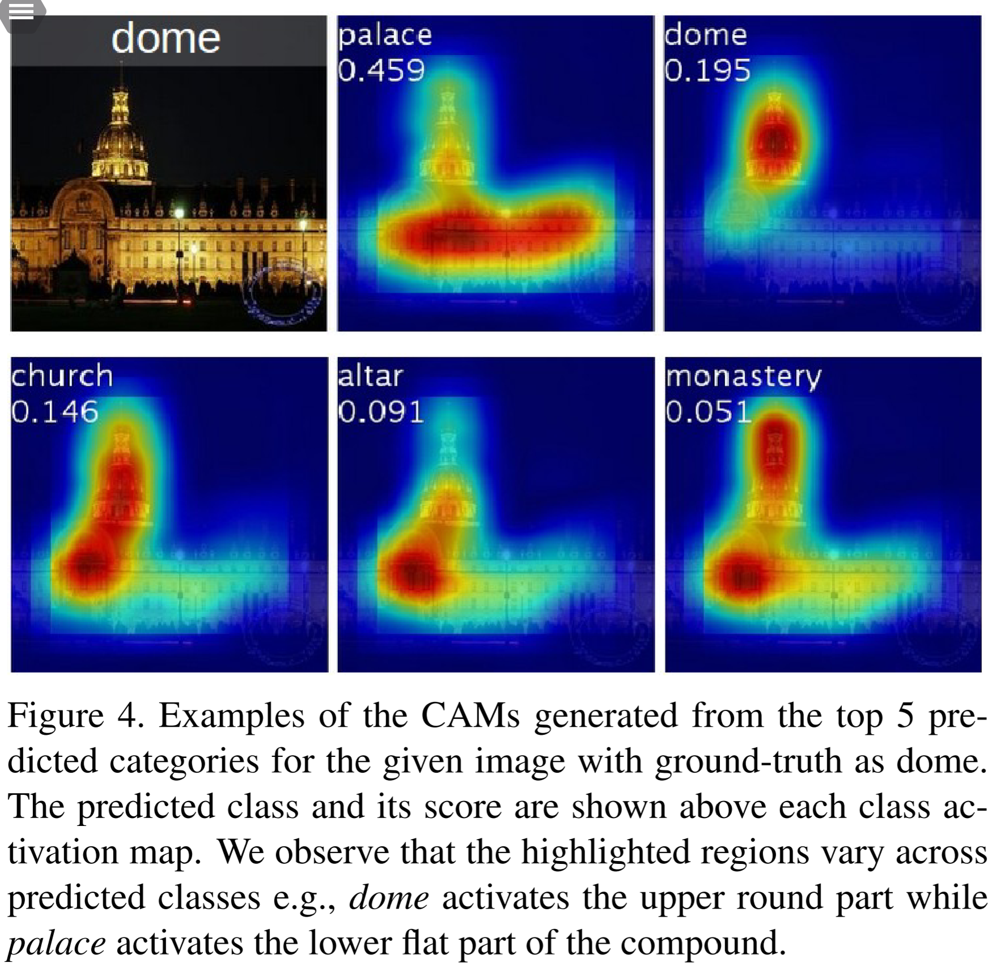
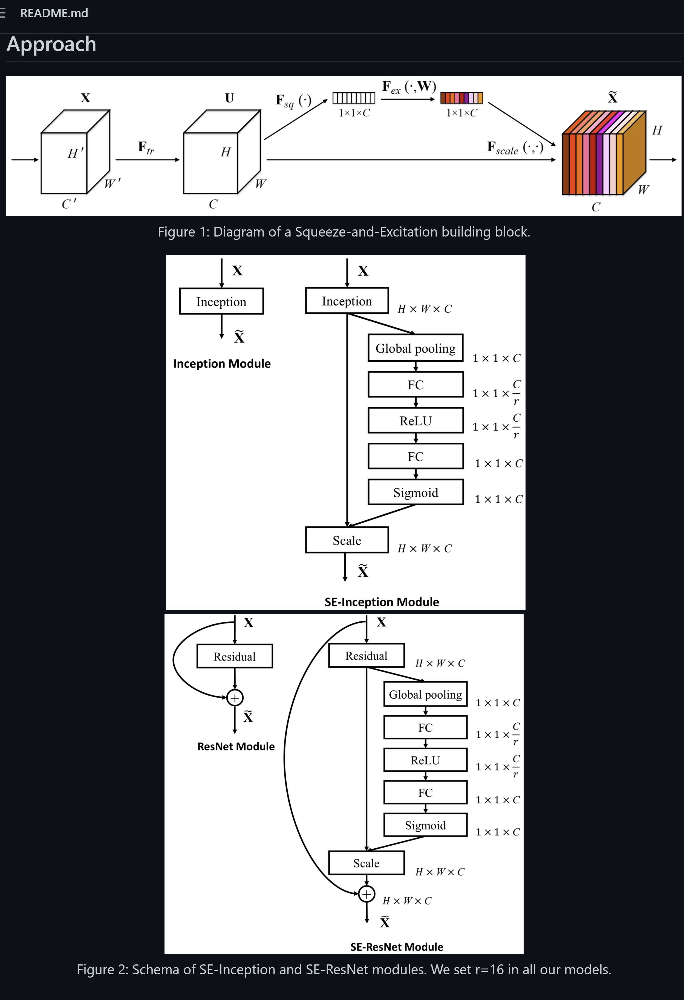

# [main-page](../README.md)

# [Learning Deep Features for Discriminative Localization](../papers/Learning.pdf)	

## Overview

## Related works
* Major topic: visualization
  * [EECS498-slides14](D:\desktop_d\yan\projects\MCL\paper\598.pdf)

* GAP: "unboxing" and avoid overfit

* Squeeze-and-Excitation Networks

## Methods

## Experiments

## Conclusion
introduce the CAM
## Questions

