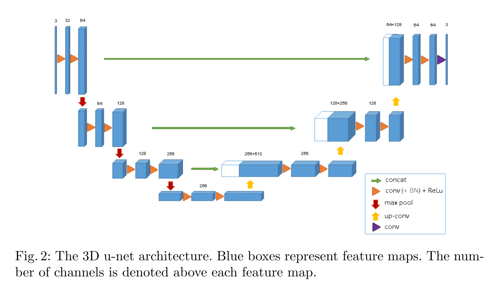

# [main-page](../README.md)

# [3D U-Net: Learning Dense Volumetric Segmentation from Sparse Annotation](../papers/3D-U-Net.pdf)

## Related works

## Overview

## Methods

## Experiments

## Conclusion

## Questions

