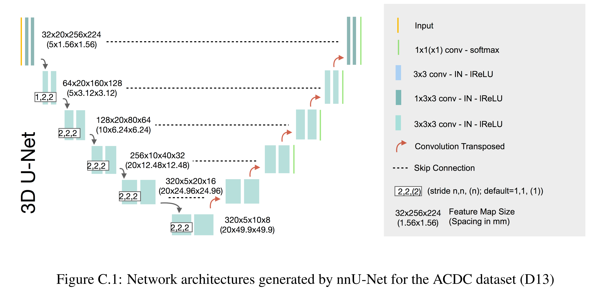

# [main-page](../README.md)

# [Automated Design of Deep Learning Methods for Biomedical Image Segmentation](../papers/Automated.pdf)

## Related works

## Overview

## Methods

## Experiments

## Contribution
* A uniformed framework for medical segmentation
## Questions

