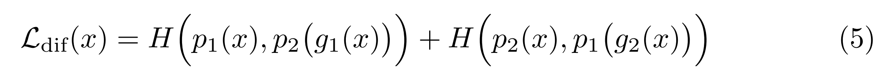
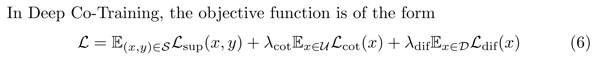

# [main-page](../README.md)

# [Deep Co-Training for Semi-Supervised Image Recognition](../papers/Deep.pdf)

## Related works
* [Uncertainty-aware multi-view co-training for semi-supervised medical image segmentation and domain adaptation](../papers/Uncertainty.pdf)||[Summary](Uncertainty.md)

## Overview

## Methods

## Experiments

## Conclusion

## Questions

