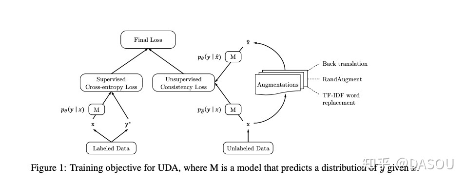
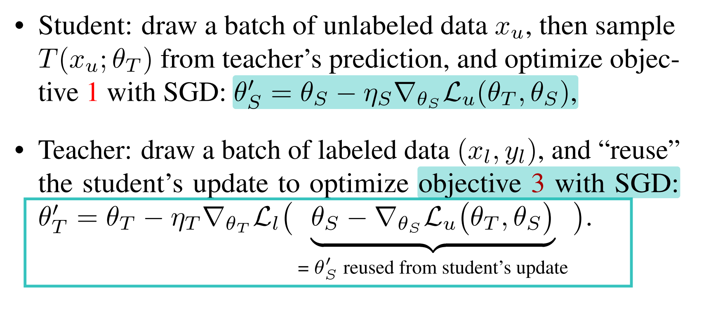
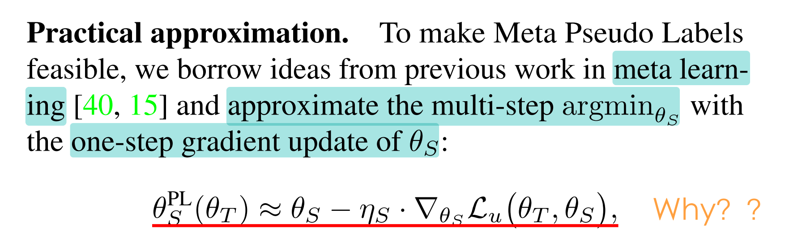
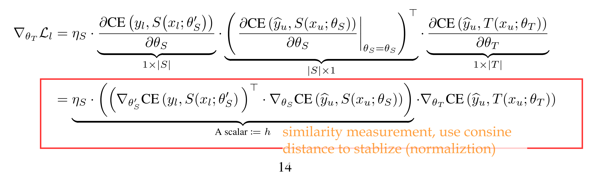
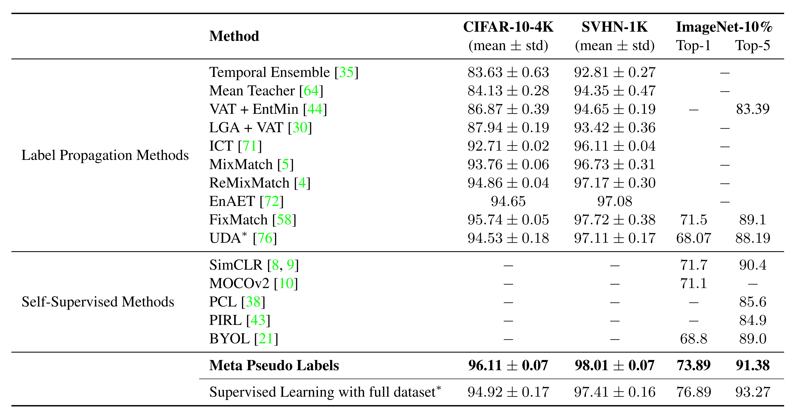
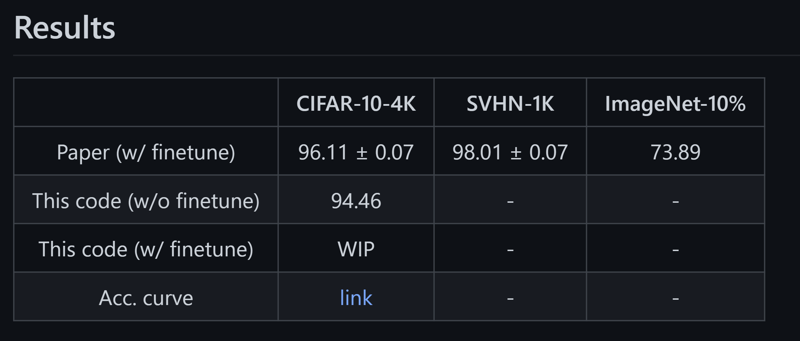

# [main-page](../README.md)

# [Meta Pseudo Labels](../papers/Meta.pdf)

## Related works
* UDA
  
* REINFORCE equation
    * [Policy Gradient](https://towardsdatascience.com/policy-gradient-methods-104c783251e0) 
      
    * [Simple Statistical Gradient-Following Algorithms for Connectionist Reinforcement Learning](../papers/Simple.pdf) | 
    
## Overview

## Methods

## Experiments
* claimed SOTA:

  
* reproduction

## Contribution
* combine RL with semi-supervised learning, especially pseudo label, cool !
* indicate that PL can work fairly well !
## Questions

