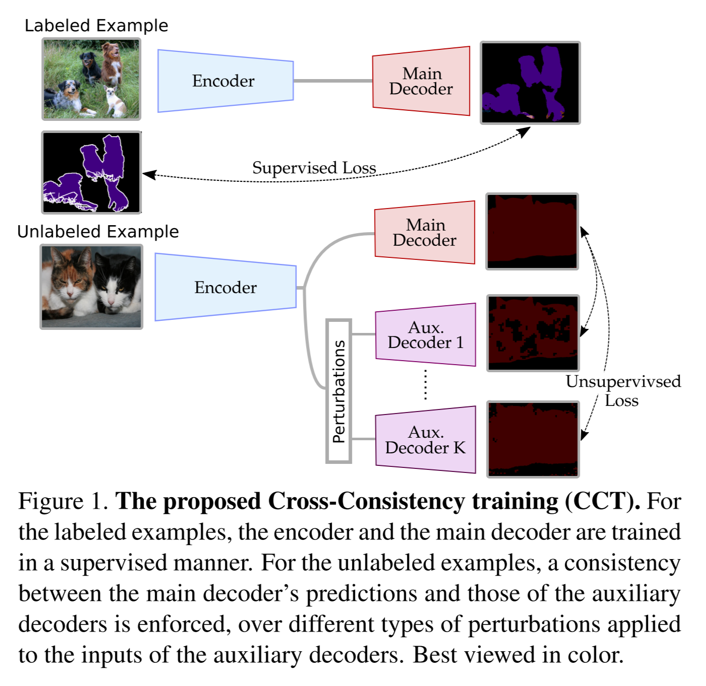

# [main-page](../README.md)

# [Semi-Supervised Semantic Segmentation with Cross-Consistency Training](../papers/Semi.pdf)

## Related works
* MixMatch?
* [pseudoSeg](../papers/PSEUDOSEG.pdf), [Summary](PSEUDOSEG-s.md)

## Overview
* perturbation on high dimensional features

## Methods

## Experiments

## Contribution
* New SOTA with complicated tricks

## Questions

