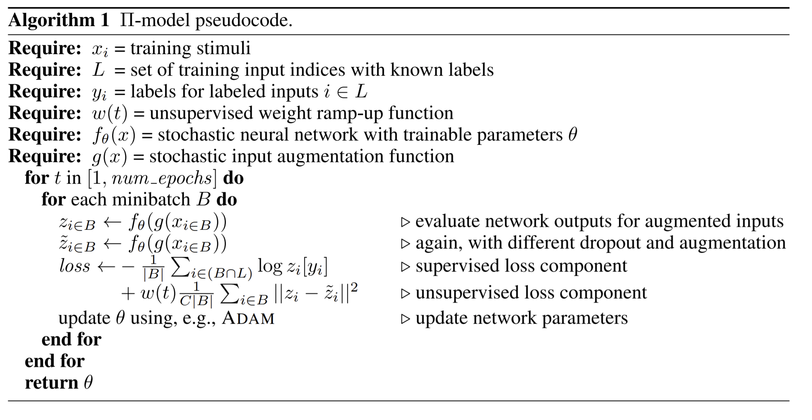
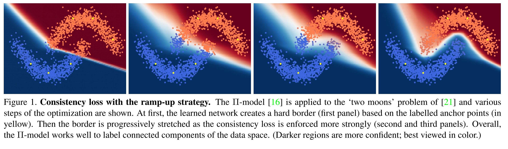

# [main-page](../README.md)

# [Semi-Supervised Learning with Scarce Annotations](../papers/SemiSupervisedLearning.pdf)

## Related works
* pi model

    
## Overview

## Methods

## Experiments

## Contribution

## Questions

