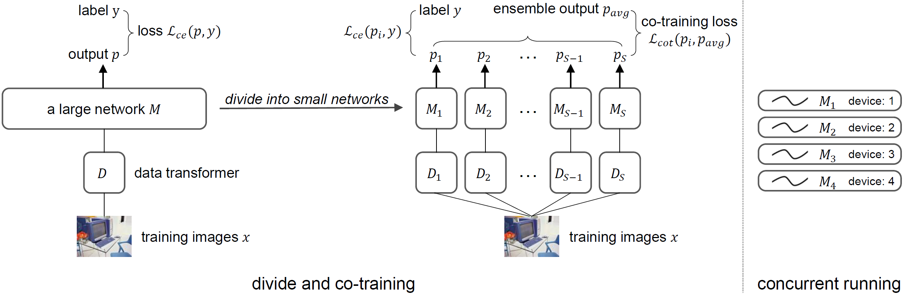

# [main-page](../README.md)

# [Towards Better Accuracy-efficiency Trade-offs: Divide and Co-training](../papers/Towards.pdf)

## Related works

## Overview

## Methods

## Experiments

## Contribution

## Questions

