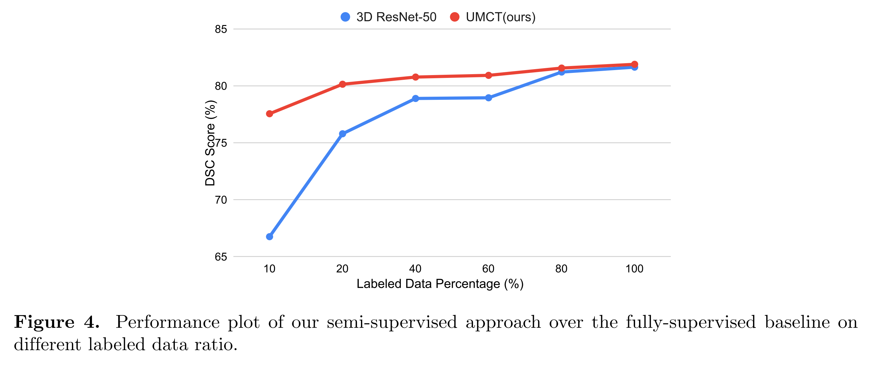
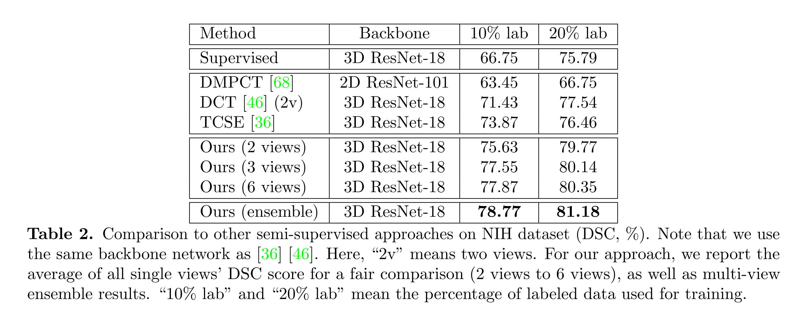
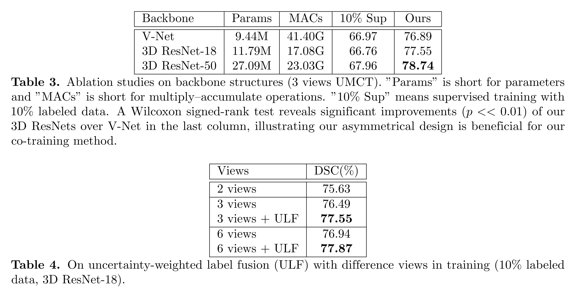

# [main-page](../README.md)

# [Uncertainty-aware multi-view co-training for semi-supervised medical image segmentation and domain adaptation1](../papers/Uncertainty.pdf)

## Related works
* [Deep Co-Training for Semi-Supervised Image Recognition](../papers/Deep.pdf) | [Summary](../summary/Deep.md)

## Overview

## Methods

## Experiments

### Train: 
* We firstly train the views separately on the labeled data and then conduct our co-training by fine-tuning the weights.
* SGD
* batchsize = 20, 4 labelled 16 unlabelled \
NIH:
  * randomly split into 20 testing cases and 62 training cases
  * 10% labeled training cases (6 labeled and 56 unlabeled), 20% labeled training cases (12 labeled and 50 unlabeled) and 100% labeled training cases  

## Conclusion

## Questions

